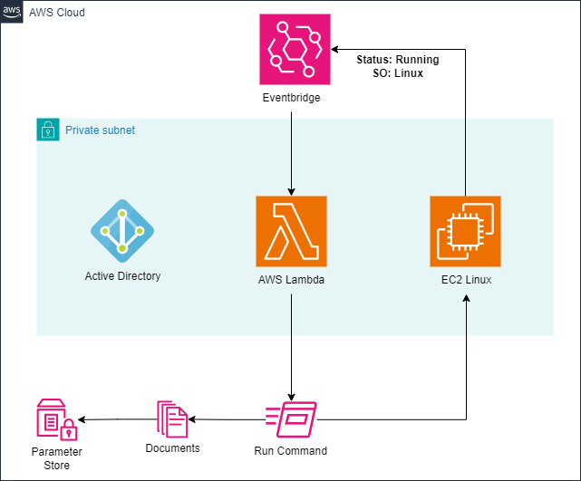

# EC2 Linux Domain Join Automation

Fully automated solution to join Linux EC2 instances to an Active Directory domain using native AWS services — no manual steps required.

## 📌 Overview

This solution automatically detects when a new Linux EC2 instance enters the `running` state and triggers a Systems Manager Run Command to join it to the domain with the correct configuration.

Powered by:

- ✅ AWS Lambda
- ✅ Amazon EventBridge
- ✅ AWS Systems Manager (SSM)
- ✅ Parameter Store
- ✅ Custom Bash Script
- ✅ Terraform for full deployment

## 🧠 How It Works

1. A Linux EC2 instance is launched.
2. EventBridge captures the state-change event (`running`).
3. Lambda function is triggered and checks if the instance is new and registered in SSM.
4. Lambda executes a custom SSM Document that:
   - Joins the instance to the AD domain
   - Configures dynamic DNS updates (SSSD)
   - Enables SSH password authentication with AD users
   - Grants sudo access to a specified AD group

## 🖼️ Architecture



## ⚙️ Requirements

### EC2 Instance
- Linux with `dnf` (Amazon Linux 3)
- IAM role with appropriate permissions 
- Network access to Active Directory Domain Controllers
- DNS pointing to the AD server
- Required open ports: 88, 389, 445, 123, 464

### SSM Parameter Store
After applying Terraform, make sure to fill in the following parameters in AWS Systems Manager Parameter Store:

| Name           | Type         | Description                                      |
|----------------|--------------|--------------------------------------------------|
| `DOMAIN`       | String       | FQDN of the AD domain                            |
| `DOMAIN_USER`  | String       | AD user with permission to join machines         |
| `DOMAIN_PASS`  | SecureString | Password for the user above                      |
| `DOMAIN_GROUP` | String       | AD group name to grant sudo access               |

### DHCP Option Set (recommended)
Configure a DHCP Option Set for your VPC to point to the AD DNS server.

---

## ☁️ Deploy with Terraform

1. Clone this repository  
2. Make sure SSM parameters are created  
3. Fill in the required variables in `terraform.tfvars`:

```hcl
region = "us-east-1"
subnet_lambda           = ["subnet-xxxxxx"]
security_group_lambda   = ["sg-xxxxxx"]
```

4. Navigate to the `terraform/` folder and run:

```bash
terraform init
terraform apply
```

---

## 📄 Technical Article

Full technical breakdown is available in the Medium article:  
📎 *[https://medium.com/@diego.broetto1/automating-linux-instance-domain-join-to-ad-with-lambda-and-ssm-on-aws-cloud-609c846181dd]*

---

## 🙋 About the Author

**Diego Broetto**  
🔗 [linkedin.com/in/diegobroetto](https://www.linkedin.com/in/diegobroetto)
